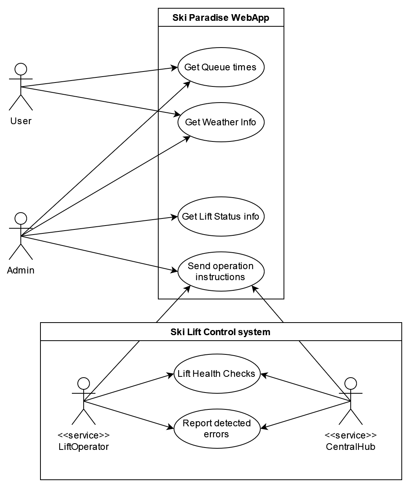

# Ski Paradise

This project is a homework assignment for the Software Architectures (VIAUMA21) class at BME, which is a class about architecture design for Computer Engineering MSc students.

The task involves creating a fully distributed system that allows for centralized monitoring and control of a large-scale ski lift operation. This system will empower ski lift operators with capabilities to efficiently manage and oversee the operation. The system will be robust and provide integrity in communication between the components.

## Goals and scope

The goal of the project is to have hands on experience with designing distributed systems and using popular design patterns. 

The scope of the project is developing the control system, a component for the individual lift operators, a web application for the administrators and the end users.

Providing real data, managing the IoT systems and accurate representation of the specific components inside a ski lift is NOT in the scope of this project. 

## Requirements

- **R1** It should be possible to track the status of the ski lifts, their occupancy, expected queue times, wind speed, etc. from a central administration interface.
- **R2** The ski lifts should be able to report detected errors and emergencies to the central component.
- **R3** Instructions should be sendable from the central hub to the operators of the ski lifts (start, stop, etc.).
- **R4** The central system should continuously monitor the components operating the ski lifts and, in the event of an error, alert the operators.
- **R5** In case of emergencies, it should be possible to reliably shut down a ski lift from the central interface.
- **R6** A separate component should display a simplified map of the ski lifts' status to the general public.
- **R7** The system components should be implemented in a distributed manner.
- **R8** Critical parts of the system should be redundantly implemented.
- **R9** Communication between the components should be established in a reliable manner.
- **R10** Changes in lift occupancy should be approximated using a simple queuing model.

## Use-cases

### Actors:
- User: Users of the Ski Paradise system.
- Admin: Administrators or staff members.
- LiftOperator: A service responsible for ski lift control.
- CentralHub: Another service responsible for ski lift control.

### Use Cases for Users:
- **Get Queue Time:** Users can access queue time information through the Ski Paradise web application.
- **Get Weather Info:** Users can check weather information via the Ski Paradise web application.

### Use Cases for Admin:
- **Get Queue Time:** Admins can also access queue time information through the Ski Paradise web application.
- **Get Weather Info:** Admins can check weather information via the Ski Paradise web application.
- **Get Lift Status Info:** Admins can obtain information about the status of ski lifts through the web application.
- **Send Operation Instructions:** Admins can send operation instructions to the ski lift control system via the Ski Paradise web application.

### Use Cases for LiftOperator (Services):
- **Send Operation Instructions:** The LiftOperator service is responsible for sending operation instructions to the ski lift control system.
- **Lift Health Checks:** The LiftOperator service performs health checks on the ski lifts.
- **Report Detected Errors:** The LiftOperator service reports any detected errors or issues with the ski lifts.

### Use Cases for CentralHub (Services):
- **Send Operation Instructions:** The CentralHub service is also responsible for sending operation instructions to the ski lift control system.
- **Lift Health Checks:** The CentralHub service performs health checks on the ski lifts.
- **Report Detected Errors:** The CentralHub service reports any detected errors or issues with the ski lifts.

## Components and Dependencies
*TODO*
