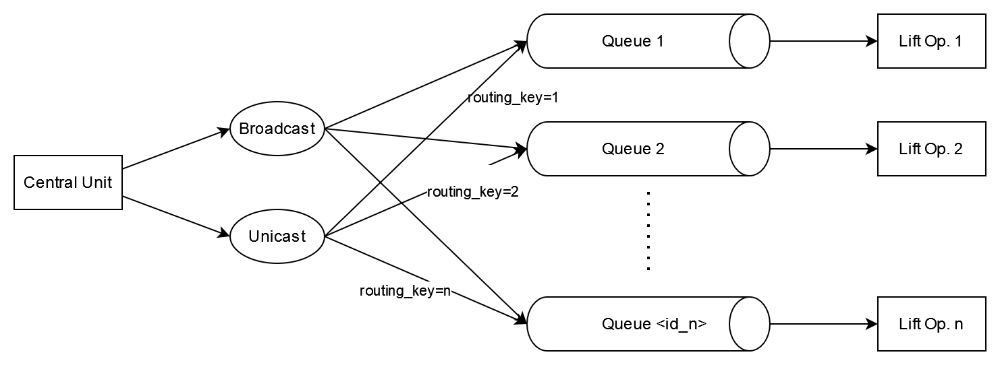
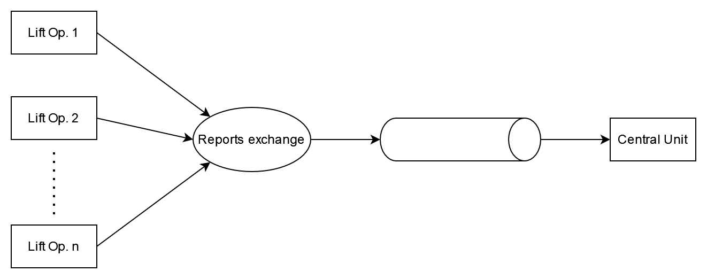

# Reliable messaging with RabbitMQ

The purpose of this document is to describe the reliable messaging process between the Lift Operators and the Central Control Unit (Central Unit). This document *does not describe* the messaging conventions used in the project, only the architecture of the messaging system used.

## Message Queues

Communication between a ski lift operator and the central control unit is considered critical because people's lives can depend on the arrival of control messages in case of an emergency. Communication must be robust, redundant in terms of the components participating and always correctly ordered. The solution for such requirements is message queues with a reliable implementation.

The implementation of our choice is RabbitMQ as it is open source, widely used, well documented and fit for the requirements of our project.

## Implementation

RabbitMQ (AMQP) messaging protocol has four components:
- A *producer* is a user application that sends messages.
- An *exchange* receives the message from the producer and pushes it to the correct queues
- A *queue* is a buffer that stores messages.
- A *consumer* is a user application that receives messages.

### Central unit as the producer


For control messages, we have the Central Control Unit as the producer. It can publish messages to a `Unicast` or a `Broadcast` exchange.

The `Broadcast` exchange is used when emergencies occur that require the whole system to stop, etc. Use this sparingly.

The `Unicast` exchange is for when a control message needs to be sent to a specific Lift Operator. Queues are addressed by the routing keys when messages are sent. The routing key of each queue is the ID of the corresponding Lift Operator. During the registration of the Operator to the Central Control Unit, a queue is defined for the Lift Operator, which starts consuming control messages afterwards.

**Control message schema:**
``` json
{
    "opcode" : int,
    "description" : string
}
```

*Note that unicast messages are routed on the producer side with the routing key, so no ID is required in the control message*

### Central unit as the consumer


Lift operators are capable of sending detected error reports to the central unit, by acting as message Producers. Operators can publish messages to the exchange called `Reports`. All error messages are routed to a single queue which is consumed by the Central Control Unit.

An example of the usage of the report exchange is an error report. 
**Error report schema:**
``` json
{
    "id" : string,
    "message" : string,
    "type" : int,
    "severity" : int
}
```
- `id` is the ID of the Lift operator that sent the message.
- `message` is a human readable description of the error, for auditing capabilities
- `type` is an enum describing the possible error types
- `severity` is an integer with range defined later, for automatic error handling and auditing purposes.

## Clustering

For the messaging to be truly reliable, the message broker needs to be redundant. RabbitMQ has clustering capabilities. In our environment a RabbitMQ cluster with a primary, secondary, and tetriary node will be used.

**TODO: work out the details**

## Useful Links:
[Intro to RabbitMQ with Spring AMQP](https://www.rabbitmq.com/tutorials/tutorial-one-spring-amqp.html) - Read this until unit 4 - Routing

[Spring AMQP](https://spring.io/projects/spring-amqp#overview)